<p align="center">
  
  
</p>

# ARM: Testing Unity assets automatically

[](LICENSE.md)
[](https://github.com/CyberAgentGameEntertainment/AssetRegulationManager/pulls)
[](#Requirements)

**Docs** ([English](README.md), [日本語](README_JA.md))

Tool for Unity to create and run tests of Asset Regulations (texture size, number of vertices, etc.), and automate running.

## Table of Contents

<!-- START doctoc generated TOC please keep comment here to allow auto update -->
<!-- DON'T EDIT THIS SECTION, INSTEAD RE-RUN doctoc TO UPDATE -->
<details>
<summary>Details</summary>

- [Concepts & Features](#concepts--features)
- [Setup](#setup)
  - [Requirements](#requirements)
  - [Install](#install)
- [Create Asset Regulation Tests](#create-asset-regulation-tests)
  - [Create an asset to store data](#create-an-asset-to-store-data)
  - [Create Asset Regulations](#create-asset-regulations)
  - [Set up targets](#set-up-targets)
  - [Set up constraints](#set-up-constraints)
  - [Details on how to use the Asset Regulation Editor](#details-on-how-to-use-the-asset-regulation-editor)
- [Execute Asset Regulation Tests](#execute-asset-regulation-tests)
  - [Asset Regulation Viewer](#asset-regulation-viewer)
  - [Details on how to use the Asset Regulation Viewer](#details-on-how-to-use-the-asset-regulation-viewer)
- [Test with command line interface (CLI)](#test-with-command-line-interface-cli)
  - [How to use](#how-to-use)
  - [Return value](#return-value)
  - [How to receive results](#how-to-receive-results)
  - [Command line arguments](#command-line-arguments)
- [Descriptions of Asset Filters](#descriptions-of-asset-filters)
- [Descriptions of Asset Constraints](#descriptions-of-asset-constraints)
- [Scripting](#scripting)
  - [Edit regulation data assets via scripts](#edit-regulation-data-assets-via-scripts)
  - [Run tests via scripts](#run-tests-via-scripts)
  - [Create custom asset filters](#create-custom-asset-filters)
  - [Create custom asset constraints](#create-custom-asset-constraints)
- [License](#license)

</details>
<!-- END doctoc generated TOC please keep comment here to allow auto update -->

## Concepts & Features
It is important to strictly manage "**Asset Regulations**" in Unity game development.
The following items are typical examples of Asset Regulations.

* Texture Size
* Number of Vertices of Mesh
* File Name

If these asset regulations are not followed or not clearly defined, the problems like below can occur.

- Asset size increases, resulting in longer download times.
- Asset size increases, resulting in longer load times.
- Memory usage increases, resulting in application crashes.
- Shader processing increases with the number of vertices, resulting in a lower frame rate.
- Fail to load due to wrong file name.


*Asset Regulation Manager* allows you to test such Asset Regulations.
Everyone (even non-engineers) can easily test through the intuitive interface as shown below.

<p align="center">
  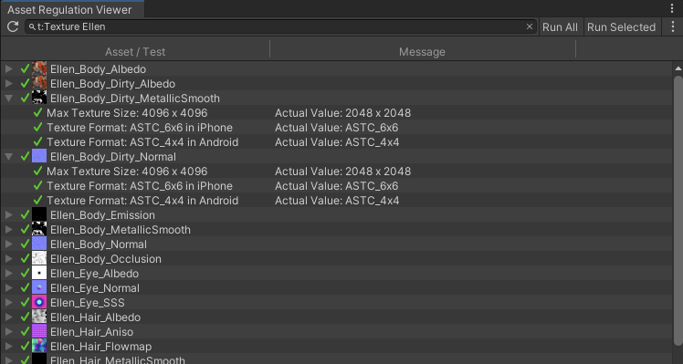<br>
  <font color="grey">Asset Regulation Viewer</font>
</p>

And the command line interface (CLI) is also available for periodic automated testing.

You can create the Asset Regulation Tests easily using the GUI tool as shown below.

<p align="center">
  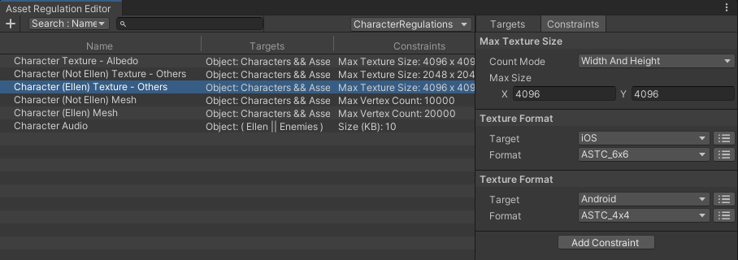<br>
  <font color="grey">Asset Regulation Editor</font>
</p>

## Setup

### Requirements
This library is compatible with the following environment.

* Unity 2019.4 or higher.

### Install
To install the software, follow the steps below.

1. Open the Package Manager from Window > Package Manager
2. "+" button > Add package from git URL
3. Enter the following
    - https://github.com/CyberAgentGameEntertainment/AssetRegulationManager.git?path=/Assets/AssetRegulationManager

<p align="center">
  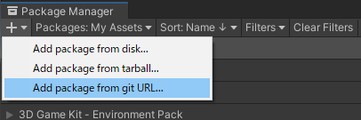
</p>

Or, open **Packages/manifest.json** and add the following to the **dependencies** block.

```json
{
    "dependencies": {
        "jp.co.cyberagent.assetregulationmanager": "https://github.com/CyberAgentGameEntertainment/AssetRegulationManager.git?path=/Assets/AssetRegulationManager"
    }
}
```

If you want to set the target version, write as follows.

- [https://github.com/CyberAgentGameEntertainment/AssetRegulationManager.git?path=/Assets/AssetRegulationManager#1.0.0](https://github.com/CyberAgentGameEntertainment/AssetRegulationManager.git?path=/Assets/AssetRegulationManager#1.0.0)

To update the version, rewrite the version as described above.
If you don't want to specify a version, you can also update the version by editing the hash of this library in the **Packages/package-lock.json** file.

```json
{
  "dependencies": {
      "jp.co.cyberagent.assetregulationmanager": {
      "version": "https://github.com/CyberAgentGameEntertainment/AssetRegulationManager.git?path=/Assets/AssetRegulationManager",
      "depth": 0,
      "source": "git",
      "dependencies": {},
      "hash": "..."
    }
  }
}
```

> **Note**  
> If you get a message like No 'git' executable was found. Please install Git on your system and restart Unity, you will need to set up Git on your machine.


## Create Asset Regulation Tests

### Create an asset to store data
To create Asset Regulation Test, first create a **Regulation Data Asset** from **Assets > Create > Asset Regulation Data**.

<p align="center">
  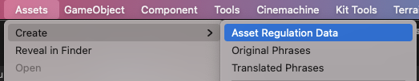<br>
  <font color="grey">Create Regulation Data Asset</font>
</p>

Data regarding Asset Regaultion Tests are stored in this asset.

You can create multiple assets in your project.
And you can place it anywhere you like, but do not place it in special folders such as StreamingAssets.

### Create Asset Regulations
Next, double-click on a regulation data asset or press the **Open Editor** button from the Inspector to open the **Asset Regulation Editor**.
Then press the **+** button in the upper left corner of this window to create a new asset regulation.

<p align="center">
  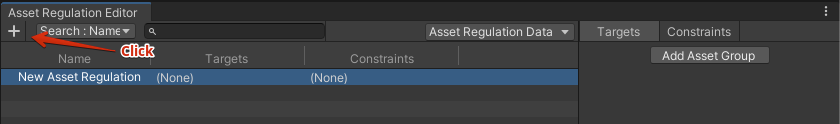<br>
  <font color="grey">Create Asset Regulation</font>
</p>

One asset regulation consists of the following two elements.

<u>***Target***</u>
- Assets to which this regulation applies.
- Specify like "All Texture2D type assets in the Character folder".

<u>***Constraint***</u>
- Constraint that the target assets must adhere to.
- "Texture Size must be 1024x1024 or smaller", "Texture format must be ASTC4x4", etc.

The next step is to set these up.

### Set up targets
To set up a target, first click the **Add Asset Group** button on the **Targets** tab in the right panel.
You will see a new **Asset Group** named **New Asset Group**.

<p align="center">
  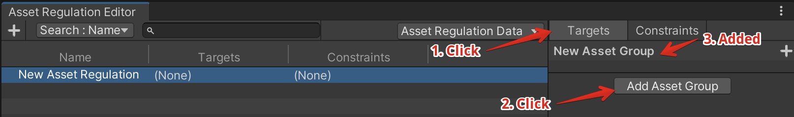<br>
  <font color="grey">Create Asset Group</font>
</p>

You can specify the target assets by adding **Asset Filters** to this asset group.
For example, to target only the assets in the **Characters** folder, press the + button to the right of the asset group name and select **Object Filter** from the menu.
And assign the **Characters** folder to the **Object** property of the added Object Filter.

<p align="center">
  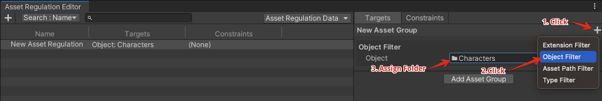<br>
  <font color="grey">Create Object Filter</font>
</p>

Next, narrow down the targets to Texture2D type assets only.
Press the + button as before and add **Type Filter**.
And set **Texture2D** to the **Type** property of the added Type Filter.

<p align="center">
  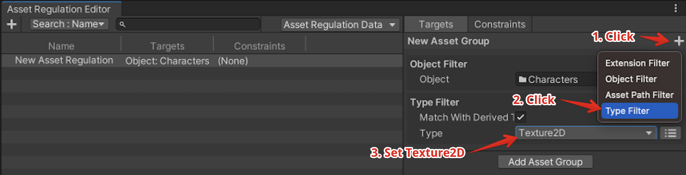<br>
  <font color="grey">Create Type Filter</font>
</p>

Now, you can target all Texture2D under the Characters folder.

Note that multiple asset groups can be set Up for a single asset regulation.
If multiple asset groups are set up, all assets indicated by each asset group will be targets.
The figure below shows an example of targeting of all Texture2D files in the Characters folder and all files with the exr extension in the CharacterHDR folder.

<p align="center">
  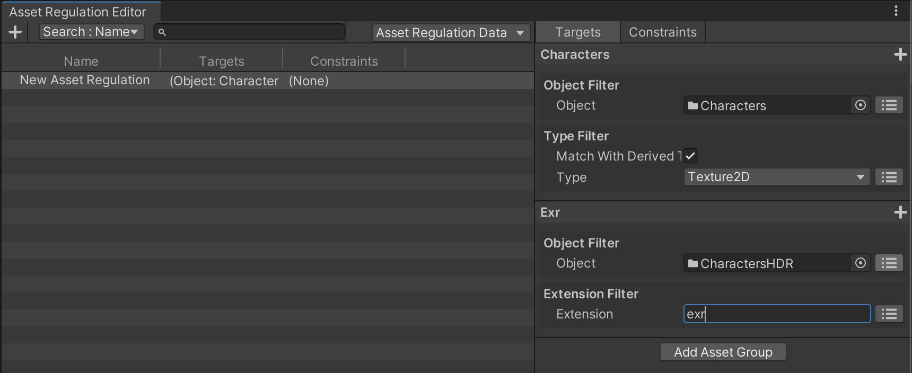<br>
  <font color="grey">Multiple Asset Groups</font>
</p>

### Set up constraints
Next, set up constraints.
First, create a constraint regarding max texture size.
Select **Add Constraint > Texture > Max Texture Size** from the **Constraints** tab in the right panel.

<p align="center">
  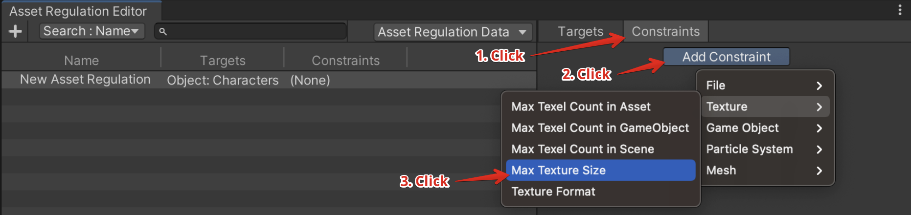<br>
  <font color="grey">Max Texture Size</font>
</p>

Enter the maximum size of the texture in the **Max Size** property of the added constraint and you are done.

<p align="center">
  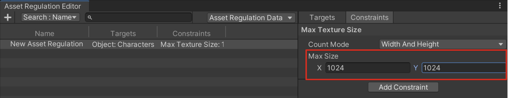<br>
  <font color="grey">Max Size</font>
</p>

In addition, add a constraint regarding texture format.  
As before, select **Add Constraint > Texture > Texture Format** to add the constraint.
This time, set **Target** to **iOS** and **Format** to **ASTC_6x6**.

<p align="center">
  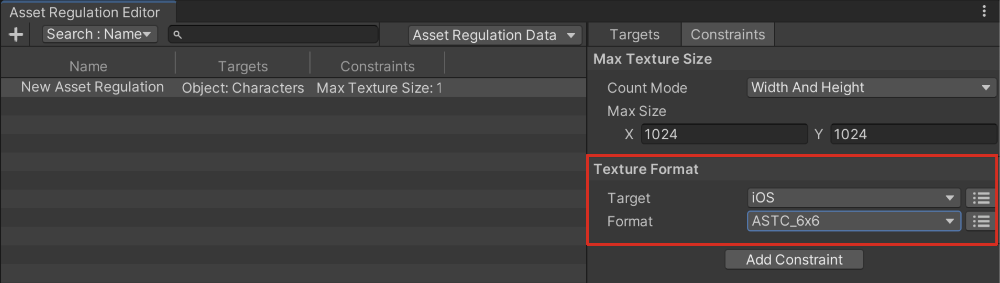<br>
  <font color="grey">Texture Format</font>
</p>

You have now set the constraint.

### Details on how to use the Asset Regulation Editor
The Asset Regulation Editor also supports the following operations.

1. Select a column to search.
2. Search regulations.
3. Select the regulation data asset to edit.
4. Rename the asset regulation.
5. Right-click menu
    - Create a new asset regulation.
    - Remove the selected asset regulation.
    - Copy target information as string.
    - Copy constraint information as string.
6. Drag to reorder asset regulations.

<p align="center">
  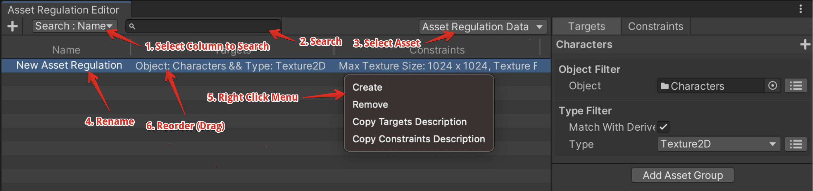<br>
  <font color="grey">Editor Operations</font>
</p>

In the **Targets** tab, you can do the followings by right-click menu of asset groups.

1. Rename the asset group name.
2. Remove the asset group.
3. Reorder the asset group (move up/down).
4. Copy and paste.
5. Paste the asset filter.

<p align="center">
  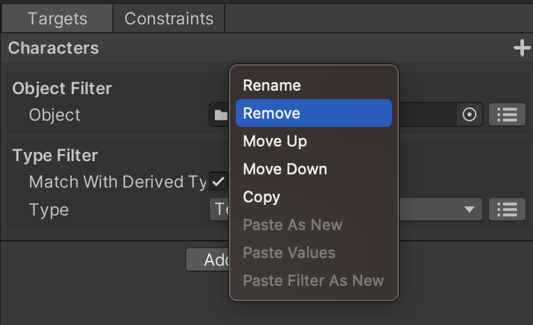<br>
  <font color="grey">Targets Operations</font>
</p>

You can also do the followings by right-click menu of asset filters.

1. Remove the asset filter.
2. Reorder the asset filter (move up/down).
3. Copy and paste.

<p align="center">
  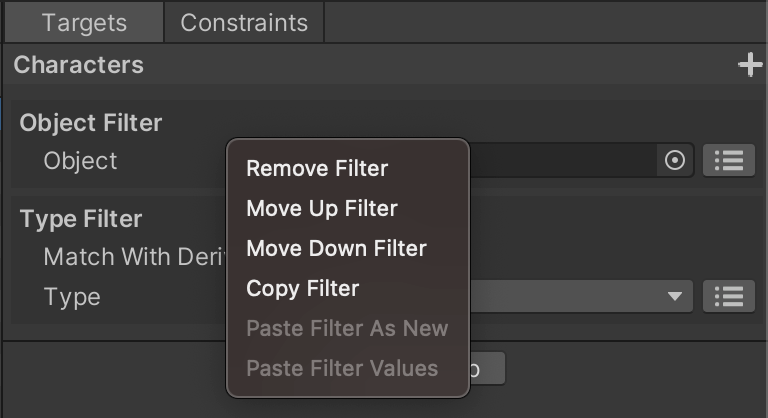<br>
  <font color="grey">Filters Operations</font>
</p>

From the right-click menu on the **Constraints** tab, you can do the followings.

1. Remove the asset constraint.
2. Reorder the asset constraint (move up/down).
3. Copy and paste.

<p align="center">
  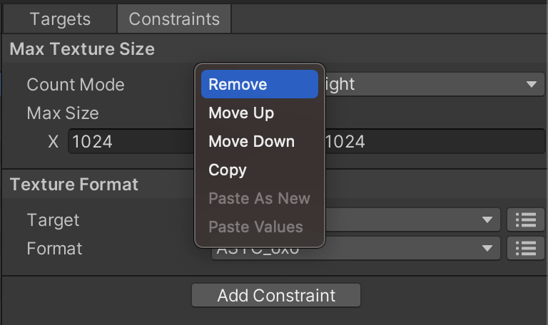<br>
  <font color="grey">Constraints Operations</font>
</p>

> **Note**  
> All operations can be undo by pressing **Ctrl (Command) + Z** and redo by pressing **Ctrl (Command) + Y**.

## Execute Asset Regulation Tests

### Asset Regulation Viewer
You can open the **Asset Regulation Viewer** from **Window > Asset Regulation Viewer** to test the asset regulations using GUI tool.

First, enter the asset name in the search field at the top of the window to search the assets.
Like the Project view, you can use type search, label search, and glob search (e.g. "t:Texture").

<p align="center">
  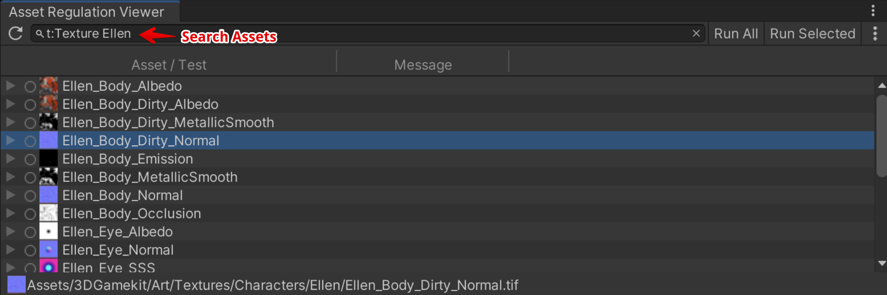<br>
  <font color="grey">Search Assets</font>
</p>

You can show the constraints for the asset by opening the toggle for each asset displayed after the search.

<p align="center">
  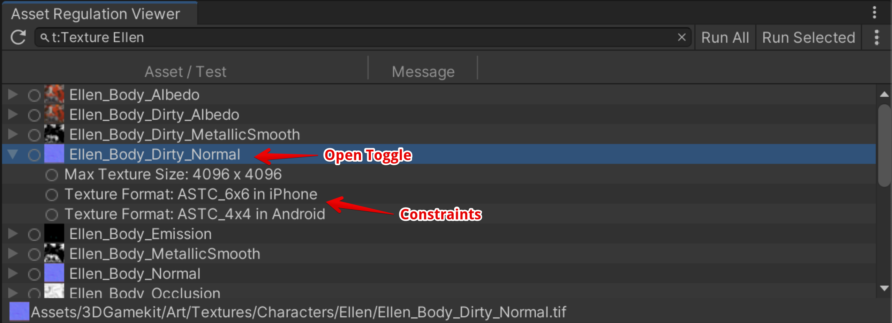<br>
  <font color="grey">Show Constraints</font>
</p>

To test Asset Regulation, double-click on the target row.

Also you can test the all displayed Asset Regulations by pressing the **Run All** button.  
If you want to test only asset regulations you selected, use the **Run Selected** button.

<p align="center">
  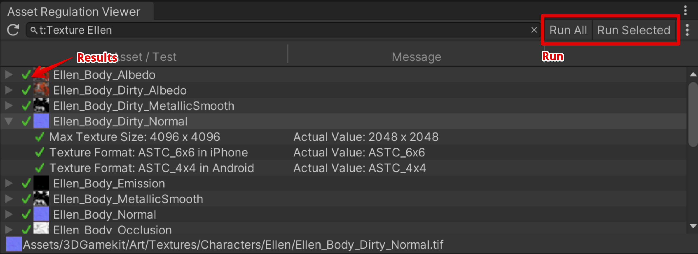<br>
  <font color="grey">Run Tests</font>
</p>

### Details on how to use the Asset Regulation Viewer
The Asset Regulation Viewer also supports the following operations.

1. Reload.
2. Open the menu.
3. Show/Hide assets with no asset regulations.
4. Export test result.

<p align="center">
  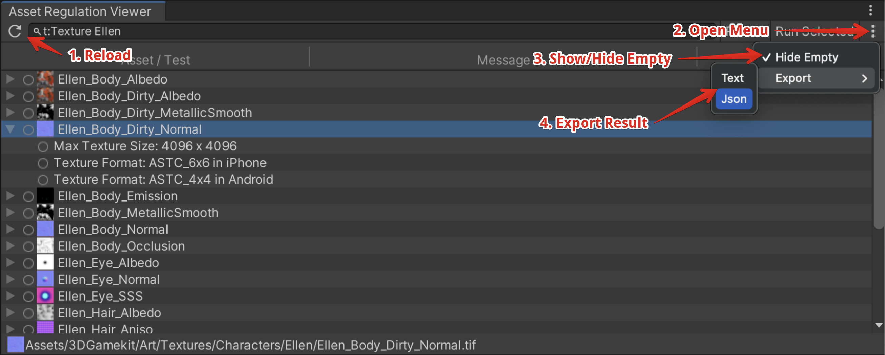<br>
  <font color="grey">Viewer Operations</font>
</p>

## Test with command line interface (CLI)

### How to use
You can test Asset Regulations with the following method.

`AssetRegulationManager.Editor.Core.Tool.Test.AssetRegulationTestCLI.AssetRegulationTestCLI.ExecuteTests`

The following is an example of command line on Mac.

```bash
/Applications/Unity/Hub/Editor/2019.4.33f1/Unity.app/Contents/MacOS/Unity -projectPath [Your Project Path Here] -executeMethod AssetRegulationManager.Editor.Core.Tool.Test.AssetRegulationTestCLI.AssetRegulationTestCLI.ExecuteTests
```

### Return value
The return value of the command line is as follows.

| Return Value | Description |
| --- | --- |
| 0 | All tests succeeded. |
| 1 | Failed test exists. But, with the -failWhenWarning option, this value is returned even when the warning is contained. |
| 2 | Execution failed. |

### How to receive results
The test results are saved to a file.
You can specify the file path using the command line argument `-resultFilePath`.

The results will be written out like following.

```
Assets/Development/DevelopmentAssets/tex_dev_red_128.png
[Success] Texture Format: RGBA32 (iPhone) | Actual Value: RGBA32
[Success] Max Texture Size: 200 x 200 | Actual Value: 128 x 128

Assets/Development/DevelopmentAssets/tex_dev_red_256.png
[Failed] Texture Format: RGBA32 (iPhone) | Actual Value: ASTC_6x6
[Failed] Max Texture Size: 200 x 200 | Actual Value: 256 x 256
```

Note that you can output the results as json like follows by specifing `Json` as the command line argument `-resultFormat`.

```json
{"results":[{"assetPath":"Assets/Development/DevelopmentAssets/tex_dev_red_128.png","entries":[{"status":"Success","description":"Texture Format: RGBA32 (iPhone)","message":"Actual Value: ASTC_6x6"},{"status":"Success","description":"Max Texture Size: 200 x 200","message":"Actual Value: 256 x 256"}]},{"assetPath":"Assets/Development/DevelopmentAssets/tex_dev_red_256.png","entries":[{"status":"Failed","description":"Texture Format: RGBA32 (iPhone)","message":"Actual Value: ASTC_6x6"},{"status":"Failed","description":"Max Texture Size: 200 x 200","message":"Actual Value: 256 x 256"}]}]}
```

### Command line arguments
The command line arguments are described below.

| Name | Description |
| --- | --- |
| -resultFilePath \<filePath> | Specifies the output file path for test results. Default value is AssetRegulationManager/test_result.txt (or .json). |
| -resultFormat \<formatName> | Specifies the output format of the results.<br><br>* List (default)<br>* Json |
| -resultFilter \<filterName> | Filters test results by status.<br><br>* All: Output all results. (default)<br>* Success: Output only successful results.<br>* Warning: Output only results with warnings.<br>* Failed: Output only failed results.<br><br>You can specify multiple options by enclosing them with "" and separating with semicolons. For example, to output warnings and failures, specify as following.<br><br>-resultFilter "Warning;Failed" |
| -assetFilter \<assetPath> | Filters test target assets. Specify the asset paths. You can specify multiple paths by enclosing them with "" and separating with semicolons. And you can also use regular expressions.<br><br>For example, to target the files that have "mesh_" or "tex_" in their path, specify as following.<br><br>-assetFilter "mesh_;tex_" |
| -regulationFilter \<regulationName> | Filters asset regulations for testing. Specify the asset regulation names. You can specify multiple regulations by enclosing them with "" and separating with semicolons. And you can also use regular expressions.<br><br>For example, to target the regulations named "Character Prefabs" and "Character Textures", specify as following.<br><br>-regulationFilter "^Character Prefabs$;^Character Textures$" |

## Descriptions of Asset Filters

| Name | Overview and Property Description |
| --- | --- |
| Object Filter | Filters by specifying the asset directly.<br>Use case: Target only assets under the Characters folder.<br><br>**Object**<br>Target asset. If you specify a folder, target all assets in the folder. Multiple items can be specified by using the right toggle. |
| Type Filter | Filters by asset type.<br>Use case: Targets only Texture2d type assets.<br><br>**Match With Derived Type**<br>If checked, derived types are also covered.<br><br>**Type**<br>Target type. Multiple items can be specified by using the right toggle. |
| Asset Path Filter | Filters by asset path.<br>Use case 1: Target assets contained in the folder named "Assets/Sample[Any 3 characters]/".<br>Use case 2: Exclude assets that contain "Dummy" in the file name.<br><br>**Asset Path (Regex)**<br>Target asset path. Assets whose paths partially match these will be targeted. You can also use regular expressions. Multiple items can be specified by using the right toggle.<br><br>**Condition**<br>Specify how to handle multiple Asset Paths.<br>* Contains Matched: Target if any asset path matches.<br>* Match All: Target if all asset paths match.<br>* Contains Unmatched: Target if any one asset path does not match.<br>* Not Match All: Target if all asset paths do not match. |
| Extension Filter | Filters by extension.<br>Use case: Target assets that have png or jpg extension.<br><br>**Extension**<br>Target extension. Multiple items can be specified by using the right toggle. |

## Descriptions of Asset Constraints
| Name | Overview and Property Description |
| --- | --- |
| File/Asset Path | Constrains asset paths.<br><br>**Asset Path (Regex)**<br>Target asset path. You can also use regular expressions. Multiple items can be specified by using the right toggle.<br><br>**Condition**<br>You can specify how to handle multiple Asset Paths.<br>* Or: Target if any asset path matches.<br>* And: Target if all asset paths match. |
| File/File Size | Constrains file size.<br><br>**Max Size**<br>Maximum asset size.<br><br>**Unit**<br>Size unit.<br>* B: Byte<br>* KB: Kilobyte (Kibibyte)<br>* MB: Megabyte (Mebibyte) |
| File/Folder | Constrains belonging folder.<br><br>**Folder**<br>Target folder. Multiple items can be specified by using the right toggle.<br><br>**Check Mode**<br>You can specify how to handle multiple folders.<br>* Contains: Check that it is included in the folder.<br>* Not Contains: Check that it is NOT included in the folder.<br><br>**Top Folder Only**<br>If checked, targets only directly under the folder. |
| Texture/Max Texture Size | Constrains texture size.<br><br>**Count Mode**<br>Specify the size calculation method.<br>* Width And Height: Specify the width and height of the texture.<br>* Texel Count: Specify the number of texels in the texture.<br><br>**Max Size / Max Texel Count**<br>Texture size. |
| Texture/Texture Format | Constrains texture format.<br><br>**Target**<br>Specify target platform. Multiple items can be specified by using the right toggle.<br><br>**Format**<br>Specify texture format. Multiple items can be specified by using the right toggle. |
| Texture/Max Texel Count in Asset | Constrains the total number of texels referenced by the asset.<br><br>**Max Count**<br>Max texel count. |
| Texture/Max Texel Count in GameObject | Constrains the total number of texels referenced by the GameObject's Renderer.<br><br>**Max Count**<br>Max texel count.<br><br>**Exclude Children**<br>If checked, child GameObjects are excluded from the check.<br><br>**Exclude Inactive**<br>If checked, inactive GameObjects are excluded from the check.<br><br>**Allow Duplicate Count**<br>If checked, counts twice if another renderer is referencing the same texture. |
| Texture/Max Texel Count in Scene | Constrains the total number of texture texels referenced by the Renderer of GameObjects in the scene.<br><br>**Max Count**<br>Maximum texel count.<br><br>**Exclude Inactive**<br>If checked, inactive GameObjects are excluded from the check.<br><br>**Allow Duplicate Count**<br>If checked, counts twice if another renderer is referencing the same texture. |
| Mesh/Max Vertex Count | Constrains the total number of mesh vertices.<br>It can be used as a constraint for Mesh and GameObjects (Prefab, FBX, etc.).<br><br>**Max Count**<br>Maximum vertex count.<br><br>**Exclude Children**<br>If checked, child GameObjects are excluded from the check.<br>Note: Only available if the target asset is GameObject.<br><br>**Exclude Inactive**<br>If checked, inactive GameObjects are excluded from the check.<br>Note: Only available if the target asset is GameObject.<br><br>**Allow Duplicate Count**<br>If checked, counts twice if another renderer is referencing the same texture.<br>Note: Only available if the target asset is GameObject. |
| Mesh/Max Vertex Count in Scene | Constrains the maximum total number of vertices for all meshes in the scene.<br><br>**Max Count**<br>Maximum vetex count.<br><br>**Exclude Inactive**<br>If checked, inactive GameObjects are excluded from the check.<br><br>**Allow Duplicate Count**<br>If checked, counts twice if another renderer is referencing the same texture. |
| GameObject/Max GameObject Count in GameObject | Constrains GameObject count in a Prefab.<br><br>**Max Count**<br>Maximum GameObject count.<br><br>**Exclude Inactive**<br>If checked, inactive GameObjects are excluded from the check. |
| GameObject/Max GameObject Count in Scene | Constrains GameObject count in a Scene.<br><br>**Max Count**<br>Maximum GameObject count.<br><br>**Exclude Inactive**<br>If checked, inactive GameObjects are excluded from the check. |
| Particle System/Max ParticleSystem Count in GameObject | Constrains particle system count in a prefab.<br><br>**Max Count**<br>Maximum particle system count.<br><br>**Exclude Inactive**<br>If checked, inactive GameObjects are excluded from the check. |
| Particle System/Max ParticleSystem Count in Scene | Constrains particle system count in a scene.<br><br>**Max Count**<br>Maximum particle system count.<br><br>**Exclude Inactive**<br>If checked, inactive GameObjects are excluded from the check. |

## Scripting

### Edit regulation data assets via scripts
To edit regulation data assets via script, do like following.

```cs
using AssetRegulationManager.Editor.Core.Data;
using AssetRegulationManager.Editor.Core.Model.AssetRegulations;
using AssetRegulationManager.Editor.Core.Model.AssetRegulations.AssetConstraintImpl;
using AssetRegulationManager.Editor.Core.Model.AssetRegulations.AssetFilterImpl;
using UnityEditor;
using UnityEngine;

public static class AssetRegulationManagerScripting
{
    [MenuItem("Asset Regulation Manager/Samples/Create Data Asset")]
    private static void CreateDataAsset()
    {
        // Create data asset.
        var store = ScriptableObject.CreateInstance<AssetRegulationSetStore>();
        AssetDatabase.CreateAsset(store, "Assets/sample.asset");

        // Create and add a regulation.
        var regulation = new AssetRegulation();
        store.Set.Add(regulation);

        // Create targets.
        var assetGroup = regulation.AddAssetGroup();
        var extensionFilter = assetGroup.AddFilter<ExtensionBasedAssetFilter>();
        extensionFilter.Extension.IsListMode = true;
        extensionFilter.Extension.AddValue("png");
        extensionFilter.Extension.AddValue("jpg");

        // Create constraints.
        var fileSizeConstraint = regulation.AddConstraint<FileSizeConstraint>();
        fileSizeConstraint.Unit = FileSizeConstraint.SizeUnit.KB;
        fileSizeConstraint.MaxSize = 50;

        EditorUtility.SetDirty(store);
        AssetDatabase.SaveAssets();
    }
}
```

### Run tests via scripts
To run regulation tests via script, do like following.

```cs
using System.Collections.Generic;
using AssetRegulationManager.Editor.Core.Data;
using AssetRegulationManager.Editor.Core.Model;
using AssetRegulationManager.Editor.Core.Model.Adapters;
using AssetRegulationManager.Editor.Core.Model.AssetRegulationTests;
using UnityEditor;

public static class AssetRegulationManagerScripting
{
    [MenuItem("Asset Regulation Manager/Samples/Execute Tests")]
    private static void ExecuteTests()
    {
        var repository = new AssetRegulationRepository();
        var testStore = new AssetRegulationTestStore();
        var assetDatabaseAdapter = new AssetDatabaseAdapter();
        var testGenerateService =
            new AssetRegulationTestGenerateService(repository, testStore, assetDatabaseAdapter);
        var testExecuteService = new AssetRegulationTestExecuteService(testStore);

        // Create tests.
        // Enter a filter as you would when searching in the project view.
        testGenerateService.Run("t:Object");

        // Filter tests.
        testStore.FilterTests(AssetRegulationTestStoreFilter.ExcludeEmptyTests);

        // Execute tests.
        testExecuteService.RunAll();

        // Export test results (optional).
        var testResultExportService = new AssetRegulationTestResultExportService(testStore);
        var exportTargetStatuses = new List<AssetRegulationTestStatus>
        {
            AssetRegulationTestStatus.Warning,
            AssetRegulationTestStatus.Failed
        };
        testResultExportService.Run("filepath.txt", exportTargetStatuses);

        // If you want to analyze the test results yourself, do as follows.
        foreach (var test in testStore.FilteredTests)
        {
            var targetAssetPath = test.AssetPath;
            // This will be Success if the status of the all entries is Success.
            var testStatus = test.LatestStatus.Value;

            foreach (var entry in test.Entries.Values)
            {
                // e.g. Success
                var testEntryStatus = entry.Status.Value;
                // e.g. Max Texture Size: 200 x 200
                var testEntryDescription = entry.Description;
                // e.g. Actual Value: 128 x 128
                var message = entry.Message.Value;
            }
        }
    }
}
```

### Create custom asset filters
You can create your own asset filter by creating a class derived from `AssetFilterBase` in the Editor folder.

```cs
using System;
using AssetRegulationManager.Editor.Core.Model.AssetRegulations;
using AssetRegulationManager.Editor.Core.Model.AssetRegulations.AssetFilterImpl;

[Serializable]
[AssetFilter("Custom Filter", "Custom Filter")] // Required for GUI.
public class CustomAssetFilter : AssetFilterBase
{
    public string AssetPathToMatch { get; set; }

    /// This will be called before and less often than IsMatch.
    /// And will be executed in the main thread, in contrast to IsMatch.
    /// So you should write heavy processes or processes that use Unity's API here.
    public override void SetupForMatching()
    {
    }

    // Return true if the asset passes this filter.
    // This may be executed outside the main thread.
    public override bool IsMatch(string assetPath, Type assetType)
    {
        return AssetPathToMatch == assetPath;
    }

    // A description of this asset filter.
    public override string GetDescription()
    {
        return string.IsNullOrEmpty(AssetPathToMatch) ? string.Empty : $"Asset Path: {AssetPathToMatch}";
    }
}
```

A class derived from `GUIDrawer` is also required for GUI.

```cs
using AssetRegulationManager.Editor.Foundation.CustomDrawers;
using UnityEditor;

[CustomGUIDrawer(typeof(CustomAssetFilter))]
public sealed class CustomAssetFilterDrawer : GUIDrawer<CustomAssetFilter>
{
    public override void Setup(object target)
    {
        base.Setup(target);

        // If you want to setup this drawer, write here.
    }

    protected override void GUILayout(CustomAssetFilter target)
    {
        target.AssetPathToMatch = EditorGUILayout.TextField("Asset Path", target.AssetPathToMatch);
    }
}
```

Now you have created the custom asset filter.

<p align="center">
  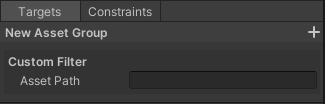<br>
  <font color="grey">Custom Filter</font>
</p>

### Create custom asset constraints
You can create your own asset constraint by creating a class derived from `AssetConstraint` in the Editor folder.

```cs
using System;
using System.IO;
using AssetRegulationManager.Editor.Core.Model.AssetRegulations;
using UnityEditor;
using UnityEngine;
using UnityEngine.Assertions;
using Object = UnityEngine.Object;

[Serializable]
[AssetConstraint("Custom/Custom Constraint", "Custom Constraint")] // Required for GUI.
public sealed class CustomAssetConstraint : AssetConstraint<Object>
{
    [SerializeField] private string _assetName;

    private string _latestValue;

    public string AssetName
    {
        get => _assetName;
        set => _assetName = value;
    }

    // Get a description of this constraint.
    public override string GetDescription()
    {
        return $"Asset Name: {_assetName}";
    }

    // Returns the most recently used value for the test as a string.
    public override string GetLatestValueAsText()
    {
        return string.IsNullOrEmpty(_latestValue) ? "None" : _latestValue;
    }

    // Returns true if the asset is within constraints.
    protected override bool CheckInternal(Object asset)
    {
        Assert.IsNotNull(asset);

        var assetPath = AssetDatabase.GetAssetPath(asset);
        var assetName = Path.GetFileNameWithoutExtension(assetPath);
        _latestValue = assetName;

        return _assetName == assetName;
    }
}
```

A class derived from `GUIDrawer` is also required for GUI.

```cs
using AssetRegulationManager.Editor.Foundation.CustomDrawers;
using UnityEditor;

[CustomGUIDrawer(typeof(CustomAssetConstraint))]
public sealed class CustomAssetConstraintDrawer : GUIDrawer<CustomAssetConstraint>
{
    public override void Setup(object target)
    {
        base.Setup(target);

        // If you want to setup this drawer, write here.
    }

    protected override void GUILayout(CustomAssetConstraint target)
    {
        target.AssetName = EditorGUILayout.TextField("Asset Name", target.AssetName);
    }
}
```

Now you have created the custom asset constraint.

<p align="center">
  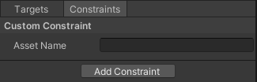<br>
  <font color="grey">Custom Constraint</font>
</p>

## License
This software is released under the MIT license. You are free to use it within the scope of the license, but the following copyright and license notices are required.

* [LICENSE.md](LICENSE.md)

In addition, the table of contents for this document has been created using the following software.

* [toc-generator](https://github.com/technote-space/toc-generator)

See [Third Party Notices.md](Third%20Party%20Notices.md) for more information about the license of toc-generator.
