<h1 align="center">Asset Regulation Manager</h1>

[](LICENSE.md)
[](https://github.com/CyberAgentGameEntertainment/AssetRegulationManager/pulls)
[](#Requirements)

**ドキュメント** ([English](README.md), [日本語](README_JA.md))

Unityでアセットレギュレーションを管理・テストするためのツールです。

## 目次

<!-- START doctoc generated TOC please keep comment here to allow auto update -->
<!-- DON'T EDIT THIS SECTION, INSTEAD RE-RUN doctoc TO UPDATE -->
<!-- param::title::詳細:: -->

<!-- END doctoc generated TOC please keep comment here to allow auto update -->

## コンセプトと特徴
Unityゲーム開発において「**アセットレギュレーション**」を厳密に管理することは重要です。  
アセットレギュレーションの代表的な例としては以下のような項目が挙げられます。

- テクスチャのサイズ
- メッシュの頂点数
- ファイル名

もしこれらのアセットレギュレーションが明確に定められていなかったり、あるいは守られていなかったりすると、以下のような問題が起こり得ます。

- アセットの容量が増大してダウンロードに掛かる時間が長くなる
- アセットの容量が増大してロードに掛かる時間が長くなる
- メモリ使用量が増大してアプリがクラッシュする
- 頂点数とともにシェーダの処理負荷が増大しフレームレートが低下する
- ファイル名が間違えていて読み込めない

*Asset Regulation Manager* を使うと、このようなアセットのレギュレーションをGUIツールを使って設定・管理することできます。

<p align="center">
  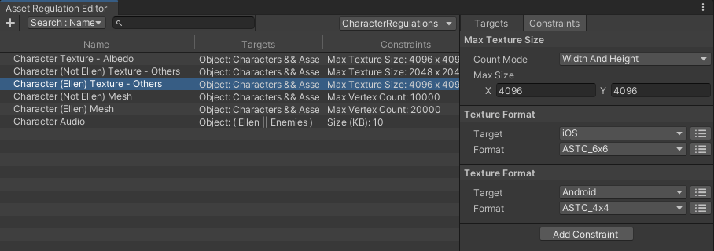<br>
  <font color="grey">Asset Regulation Editor</font>
</p>

設定したアセットレギュレーションはビューワで確認・テストすることができます。  
ビューワは直感的なインターフェースを持ち、誰でも（エンジニア以外でも）簡単に自分がインポートしたアセットをチェックできます。

<p align="center">
  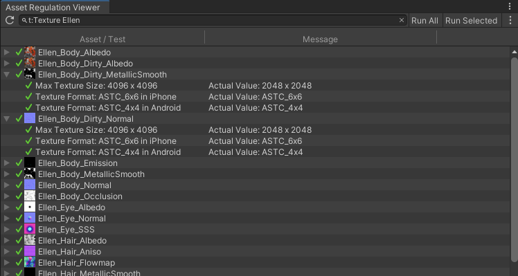<br>
  <font color="grey">Asset Regulation Viewer</font>
</p>

またコマンドラインインターフェース(CLI)を用意しているため、定期的に自動テストして結果を通知するといった CI/CD も実現できます。

## セットアップ

### 要件
本ライブラリは以下の環境に対応しています。

* Unity 2019.4 以上

### インストール
インストールは以下の手順で行います。

1. **Window > Package Manager** を選択
2. **「+」ボタン > Add package from git URL** を選択
3. 以下を入力してインストール
    - https://github.com/CyberAgentGameEntertainment/AssetRegulationManager.git?path=/Assets/AssetRegulationManager

<p align="center">
  
</p>

あるいは **Packages/manifest.json** を開き、**dependencies** ブロックに以下を追記します。

```json
{
    "dependencies": {
        "jp.co.cyberagent.assetregulationmanager": "https://github.com/CyberAgentGameEntertainment/AssetRegulationManager.git?path=/Assets/AssetRegulationManager"
    }
}
```

バージョンを指定したい場合には以下のように記述します（バージョンは適宜書き換えてください）。

- [https://github.com/CyberAgentGameEntertainment/AssetRegulationManager.git?path=/Assets/AssetRegulationManager#1.0.0](https://github.com/CyberAgentGameEntertainment/NovaShader.git?path=/Assets/Nova#1.0.0)

バージョンを更新するには上述の手順でバージョンを書き換えてください。  
バージョンを指定しない場合には、**package-lock.json** ファイルを開いて本ライブラリの箇所のハッシュを書き換えることで更新できます。

```json
{
  "dependencies": {
      "jp.co.cyberagent.assetregulationmanager": {
      "version": "https://github.com/CyberAgentGameEntertainment/AssetRegulationManager.git?path=/Assets/AssetRegulationManager",
      "depth": 0,
      "source": "git",
      "dependencies": {},
      "hash": "..."
    }
  }
}
```

なお`No 'git' executable was found. Please install Git on your system and restart Unity`のようなメッセージが出た場合、マシンにGitをセットアップする必要がある点にご注意ください。

## アセットレギュレーションを設定・管理する

### データを保存するためのアセットを作成する
アセットレギュレーションを設定するにはまず、**Assets > Create > Asset Regulation Data** から**レギュレーションデータアセット**を作成します。

<p align="center">
  <br>
  <font color="grey">Create Regulation Data Asset</font>
</p>

アセットレギュレーションに関するデータはこのアセットに保存されます。

このアセットはプロジェクト内に複数作成可能です。  
また任意の場所に配置可能ですが、StreamingAssets などの特殊フォルダには配置しないでください。

### アセットレギュレーションを作成する
レギュレーションデータアセットをダブルクリックするか Inspector から **Open Editor** ボタンを押下すると、**アセットレギュレーションエディタ**が開かれます。  
ウィンドウ左上の **+** ボタンを押下することでアセットレギュレーションを新規作成することができます。

<p align="center">
  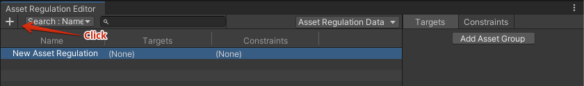<br>
  <font color="grey">Create Asset Regulation</font>
</p>

1つのアセットレギュレーションは以下の2つの要素から構成されます。

***ターゲット***
- このレギュレーションの適用対象とするアセット群のこと
- 「Character フォルダに入った Texture2D 型のアセット全て」のような形式で指定する

***コンストレイント***
- ターゲットのアセットが守るべき制約のこと
- 「テクスチャサイズが 1024x1024 以下」「テクスチャフォーマットが ASTC4x4」など

次節からはこれらを設定していきます。

### ターゲットを設定する
ターゲットを設定するにはまず、右側のパネルの **Targets** タブから **Add Asset Group** ボタンを押下します。  
すると **New Asset Group** という名前の**アセットグループ**が新規作成されることを確認できます。

<p align="center">
  <br>
  <font color="grey">Create Asset Group</font>
</p>

このアセットグループに対して**アセットフィルタ**を追加することで、対象のアセットを絞り込んでいきます。  
例えば **Characters** フォルダ配下のアセットだけを対象にするには、アセットグループ名の右側の + ボタンを押下し、表示されたメニューから **Object Filter** を選択して追加します。  
そして追加した Object Filter の **Object** プロパティに **Characters** フォルダをアサインします。

<p align="center">
  <br>
  <font color="grey">Create Object Filter</font>
</p>

さらに Texture2D 型のアセットのみを対象にしてみます。  
先程と同様に + ボタンを押下し、**Type Filter** を選択して追加します。  
追加された Type Filter の **Type** プロパティに **Texture2D** を設定します。

<p align="center">
  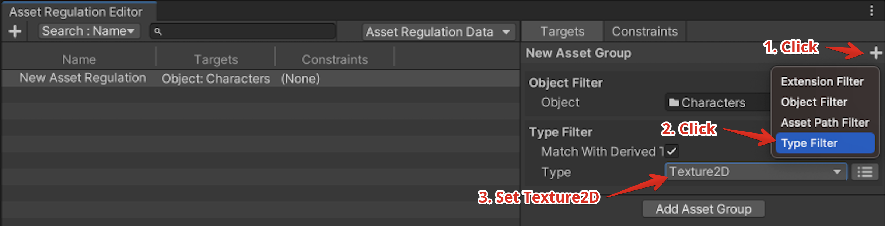<br>
  <font color="grey">Create Type Filter</font>
</p>

これで、Characters フォルダ配下の全ての Texture2D をターゲットすることができました。

なお、アセットグループは一つのアセットレギュレーションに対して複数設定することが可能です。  
複数のアセットグループを設定した場合、各アセットグループが示すアセット全てがターゲットとなります。

<p align="center">
  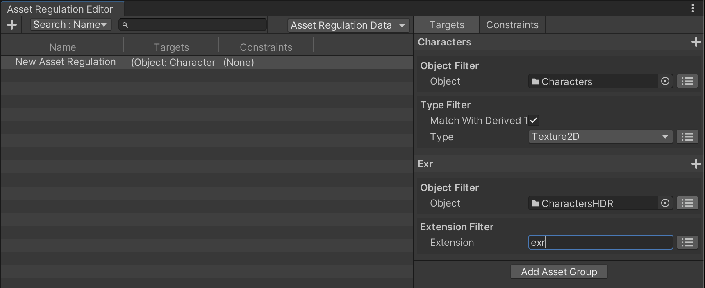<br>
  <font color="grey">Multiple Asset Groups</font>
</p>

### コンストレイントを設定する
次にコンストレイントを設定していきます。  
まずテクスチャサイズの最大値に関する制約を作成します。  
右側のパネルの **Constraints** タブから、**Add Constraint > Texture > Max Texture Size** を選択します。

<p align="center">
  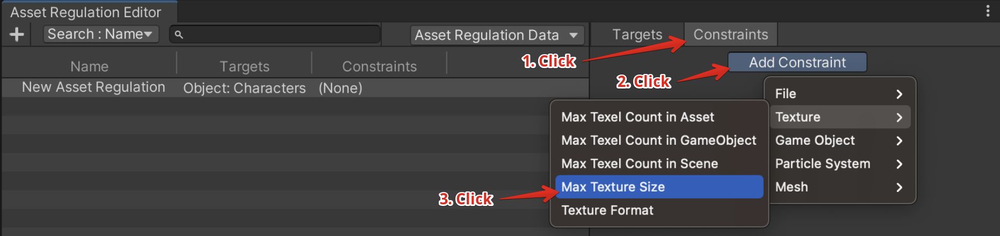<br>
  <font color="grey">Max Texture Size</font>
</p>

追加されたコンストレイントの **Max Size** プロパティにテクスチャの最大サイズを入力すれば設定完了です。

<p align="center">
  <br>
  <font color="grey">Max Size</font>
</p>

さらにテクスチャフォーマットに関する制約を加えていきます。  
先程と同様に **Add Constraint > Texture > Texture Format** を選択し、コンストレイントを追加します。  
今回は **Target** を **iOS** に、**Format** を **ASTC_6x6** に設定します。

<p align="center">
  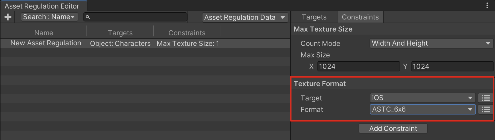<br>
  <font color="grey">Texture Format</font>
</p>

以上でアセットに対する制約を設定できました。

### アセットレギュレーションエディタの操作方法の詳細
アセットレギュレーションエディタでは、上記で紹介したもの以外にも、以下の操作をサポートしています。

1. 検索対象のカラムを選択
2. レギュレーションを検索・絞り込み
3. 編集するレギュレーションデータアセットを選択
4. アセットレギュレーションのリネーム
5. 右クリックメニュー
    - アセットレギュレーションを新規作成
    - 選択中のアセットレギュレーションを削除
    - ターゲットの情報を文字列としてコピー
    - コンストレイントの情報を文字列としてコピー
6. ドラッグしてアセットレギュレーションを並び替え

<p align="center">
  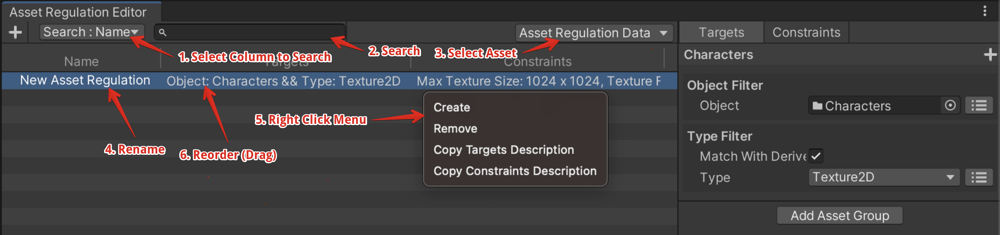<br>
  <font color="grey">Editor Operations</font>
</p>

**Targets** タブにおいてアセットグループを右クリックすると以下の操作が行えます。

1. アセットグループ名をリネーム
2. アセットグループを削除
3. アセットグループの順序を変更（一つ上へ/一つ下へ）
4. コピー & ペースト
5. アセットフィルタをペースト

<p align="center">
  <br>
  <font color="grey">Targets Operations</font>
</p>

また、アセットフィルタの右クリックメニューからは以下の操作を行うことができます。

1. アセットフィルタを削除
2. アセットフィルタの順序を変更（一つ上へ/一つ下へ）
3. コピー & ペースト

<p align="center">
  <br>
  <font color="grey">Filters Operations</font>
</p>

**Constraints** タブについても右クリックメニューからの操作をサポートしています。

1. アセットコンストレイントを削除
2. アセットコンストレイントの順序を変更（一つ上へ/一つ下へ）
3. コピー & ペースト

<p align="center">
  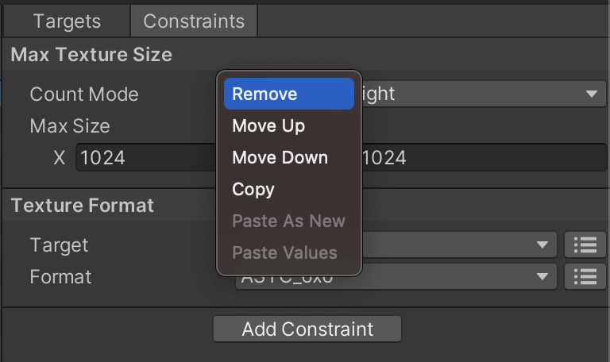<br>
  <font color="grey">Constraints Operations</font>
</p>

なお全ての操作は **Ctrl (Command) + Z** で Undo、**Ctrl (Command) + Y** で Redo できます。

## アセットレギュレーションを確認・テストする

### ビューワで確認・テストする
アセットレギュレーションをGUIツールを使って確認・テストするには、 **Window > Asset Regulation Viewer** から **アセットレギュレーションビューワ** を開きます。

ウィンドウ上部の検索フィールドにアセット名を入れて検索を行います。  
Project ビューの検索フィールドと同様に、タイプ検索やラベル検索、Glob 検索なども使用できます。

また検索結果として表示された各アセットのトグルを開くことで、そのアセットに設定されている制約を見ることができます。

<p align="center">
  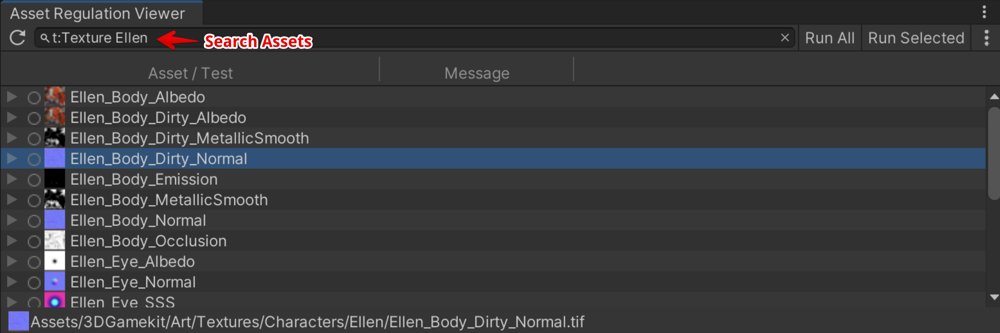<br>
  <font color="grey">Asset Regulation Viewer</font>
</p>

アセットレギュレーションをテストするには対象の行をダブルクリックします。

また、**Run All** ボタンを押下すると表示中の全てのアセットのレギュレーションをテストします。  
**Run Selected** を押下すると選択している全てのアセットのレギュレーションをテストします。

<p align="center">
  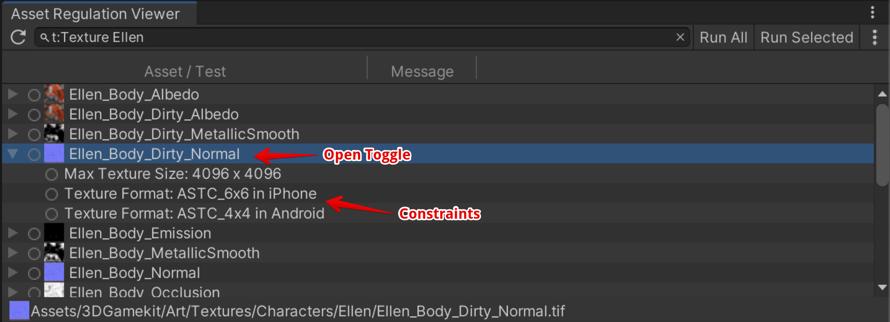<br>
  <font color="grey">Run Tests</font>
</p>

### ビューワの操作方法の詳細
アセットレギュレーションビューワでは、上記で紹介した以外にも以下の操作をサポートしています。

1. リロード
2. メニューを開く
3. アセットレギュレーションが設定されていないアセットを表示・非表示にする
4. テスト結果をエクスポートする

<p align="center">
  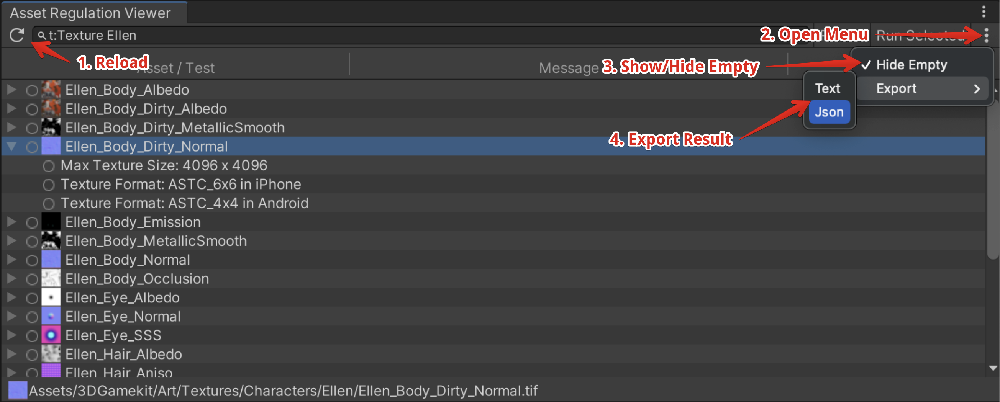<br>
  <font color="grey">Viewer Operations</font>
</p>

## コマンドラインインターフェース (CLI)で確認・テストする

### 実行方法

コマンドラインから実行するには`AssetRegulationManager.Editor.Core.Tool.Test.AssetRegulationTestCLI.AssetRegulationTestCLI.ExecuteTests`を呼びます。

以下はMacでコマンドライン実行を行う例です。

```bash
/Applications/Unity/Hub/Editor/2019.4.33f1/Unity.app/Contents/MacOS/Unity -projectPath [Your Project Path Here] -executeMethod AssetRegulationManager.Editor.Core.Tool.Test.AssetRegulationTestCLI.AssetRegulationTestCLI.ExecuteTests
```

### 戻り値
コマンドラインの戻り値はエラーレベルに応じて以下の通り返却します。

| 戻り値 | 説明 |
| --- | --- |
| 0 | 全てのテストが成功。 |
| 1 | 失敗したテストが存在する。 <br>ただし-failWhenWarningオプションをつけた場合には、警告が発生したテストが存在した場合にも1を返す。 |
| 2 | 実行自体が失敗。 |

### 結果の受け取り方
テストの結果はファイルに保存されます。  
コマンドライン引数を使って任意のファイルパスを指定できます。

結果は以下のような形式で書き出されます。

```
Assets/Development/DevelopmentAssets/tex_dev_red_128.png
[Success] Texture Format: RGBA32 (iPhone) | Actual Value: RGBA32
[Success] Max Texture Size: 200 x 200 | Actual Value: 128 x 128

Assets/Development/DevelopmentAssets/tex_dev_red_256.png
[Failed] Texture Format: RGBA32 (iPhone) | Actual Value: ASTC_6x6
[Failed] Max Texture Size: 200 x 200 | Actual Value: 256 x 256
```

なおコマンドライン引数を指定することで以下のようなJson形式で結果を書き出すことも可能です。

```json
{"results":[{"assetPath":"Assets/Development/DevelopmentAssets/tex_dev_red_128.png","entries":[{"status":"Success","description":"Texture Format: RGBA32 (iPhone)","message":"Actual Value: ASTC_6x6"},{"status":"Success","description":"Max Texture Size: 200 x 200","message":"Actual Value: 256 x 256"}]},{"assetPath":"Assets/Development/DevelopmentAssets/tex_dev_red_256.png","entries":[{"status":"Failed","description":"Texture Format: RGBA32 (iPhone)","message":"Actual Value: ASTC_6x6"},{"status":"Failed","description":"Max Texture Size: 200 x 200","message":"Actual Value: 256 x 256"}]}]}
```

### コマンドライン引数
コマンドライン引数の種類と説明は以下の通りです。

| 名前 | 説明 |
| --- | --- |
| -resultFilePath <filePath> | テスト結果の出力ファイルパスを指定します。<br>デフォルトはAssetRegulationManager/test_result.txt (or .json) |
| -resultFormat <formatName> | テスト結果の出力形式を指定します。<br>・List: リスト形式 (default)<br>・Json: Json形式 |
| -resultFilter <filterName> | テスト結果をステータスに応じてフィルタリングします。<br>・All: すべての結果を出力 (default)<br>・Success: 成功したもののみを出力<br>・Warning: 警告があったもののみを出力<br>・Failed: 失敗したもののみを出力<br><br>””で囲った上でセミコロンで区切ることで複数指定できます。<br>例えば警告と失敗したものを出力するには以下のように指定します。<br><br>-resultFilter "Warning;Failed" |
| -assetFilter <assetPath> | テスト対象とするアセットをフィルタリングします。<br>対象のアセットパスを指定します。<br>””で囲った上でセミコロンで区切ることで複数指定できます。<br>また、正規表現が使用できます。<br><br>例えばファイルパスに「mesh_」か「tex_」を含むファイルのみを対象とするには、以下のように指定します。<br><br>-assetFilter "mesh_;tex_" |
| -regulationFilter <regulationName> | テストに使うレギュレーションをフィルタリングします。<br>対象のレギュレーション名を指定します。<br>””で囲った上でセミコロンで区切ることで複数指定できます。<br>また、正規表現が使用できます。<br><br>例えば「Character Prefabs」と「Character Textures」という名前のレギュレーションの対象だけをテストしたい場合には以下のように指定します。<br><br>-regulationFilter "^Character Prefabs$;^Character Textures$" |

## 各アセットフィルタの説明

| 名前 | 概要と各プロパティの説明 |
| --- | --- |
| Object Filter | アセットを直接指定してフィルタリングします。<br>使用例: Characters フォルダ以下のアセットだけをレギュレーションの対象とする。<br><br>**Object**<br>対象のアセット。<br>フォルダを指定した場合にはそのフォルダ以下の全てのアセットが対象となります。<br>右側のトグルを切り替えることで複数指定することができます。 |
| Type Filter | アセットの型を指定してフィルタリングします。<br>使用例: Texture2D 型のアセットだけをレギュレーションの対象とする。<br><br>**Match With Derived Type**<br>チェックをつけると派生型も対象とします。<br><br>**Type**<br>対象の型。<br>右側のトグルを切り替えることで複数指定することもできます。 |
| Asset Path Filter | アセットパスを指定してフィルタリングします。<br>使用例1: Assets/Sample[任意の3文字]/ というフォルダに含まれるアセットを対象とする<br>使用例2: ファイル名に「Dummy」を含むものを対象から除外する<br><br>**Asset Path (Regex)**<br>対象のアセットパス。<br>これにパスが部分一致するアセットが対象となります。<br>正規表現を使用することもできます。<br>右側のトグルを切り替えることで複数指定することもできます。<br><br>**Condition**<br>Asset Pathを複数指定する場合の取り扱い方を指定できます。<br>・Contains Matched: いずれかのアセットパスがマッチしたら対象とする<br>・Match All: 全てのアセットパスがマッチしたら対象とする<br>・Contains Unmatched: マッチしないアセットパスが一つでもあれば対象とする<br>・Not Match All: 全てのアセットパスにマッチしなかったら対象とする |
| Extension Filter | アセットの拡張子に基づいてフィルタリングします。<br>使用例: png あるいは jpg ファイルだけをレギュレーションの対象にする<br><br>**Extension**<br>対象の拡張子。<br>右側のトグルを切り替えることで複数指定することもできます。 |

## 各アセットコンストレイントの説明
| 名前 | 概要と各プロパティの説明 |
| --- | --- |
| File/Asset Path | アセットパスを制約します。<br><br>**Asset Path (Regex)**<br>対象のアセットパス。<br>正規表現を使用することもできます。<br>右側のトグルを切り替えることで複数指定することもできます。<br>**Condition**<br>Asset Pathを複数指定する場合の取り扱い方を指定できます。<br>Or: いずれかにマッチすることを条件とする<br>And: 全てにマッチすることを条件とする |
| File/File Size | ファイルサイズを制約します。<br><br>**Max Size**<br>アセットの最大サイズ。<br><br>**Unit**<br>サイズの単位を表します。<br>B: バイト<br>KB: キロバイト(キビバイト)<br>MB: メガバイト(メビバイト) |
| File/Folder | 所属するフォルダを制約します。<br><br>**Folder**<br>対象のフォルダ。<br>右側のトグルを切り替えることで複数指定することもできます。<br><br>**Check Mode**<br>Folderを複数指定する場合の取り扱い方を指定できます。<br>Contains: フォルダに含まれることを制約とする<br>Not Contains: フォルダに含まれないことを制約とする<br><br>**Top Folder Only**<br>チェックをつけるとフォルダ直下のみ判定対象となります。 |
| Texture/Max Texture Size | テクスチャサイズを制約します。<br><br>**Count Mode**<br>サイズの計算方法を指定します。<br>Width And Height: テクスチャの横幅と縦幅を指定する<br>Texel Count: テクスチャのテクセル数を指定する<br><br>**Max Size / Max Texel Count**<br>テクスチャサイズ。 |
| Texture/Texture Format | テクスチャフォーマットを制約します。<br><br>**Target**<br>対象のプラットフォームを指定します。<br>右側のトグルを切り替えることで複数指定することもできます。<br><br>**Format**<br>フォーマットを指定します。<br>右側のトグルを切り替えることで複数指定することもできます。 |
| Texture/Max Texel Count in Asset | アセットが参照するテクスチャの総テクセル数を制約します。<br><br>**Max Count**<br>テクセル数の最大値。 |
| Texture/Max Texel Count in GameObject | GameObject が参照する Renderer が持つマテリアルが参照するテクスチャの総テクセルを制約します。<br><br>**Max Count**<br>テクセル数の最大値。<br><br>**Exclude Children**<br>チェックをすると子 GameObject をチェック対象から除外します。<br><br>**Exclude Inactive**<br>チェックをすると非アクティブな GameObject をチェック対象から除外します。<br><br>**Allow Duplicate Count**<br>チェックすると、別の Renderer が同じテクスチャを参照している場合に重複してテクセル数をカウントします。 |
| Texture/Max Texel Count in Scene | シーンに存在する GameObject が参照する Renderer が持つマテリアルが参照するテクスチャの総テクセルを制限します。<br><br>**Max Count**<br>テクセル数の最大値。<br><br>**Exclude Inactive**<br>チェックをすると非アクティブなGameObjectを対象から除外します。<br><br>**Allow Duplicate Count**<br>チェックすると、別の Renderer が同じテクスチャを参照している場合に重複してテクセル数をカウントします。 |
| Mesh/Max Vertex Count | 頂点数の最大値を制約します。<br>Mesh と GameObject（PrefabやFBXなど）に対する制約として使用できます。<br><br>**Max Count**<br>頂点数の最大値。<br><br>**Exclude Children**<br>チェックをすると子 GameObject をチェック対象から除外します。<br>※ 対象のアセットが GameObject の場合のみ処理されます<br><br>**Exclude Inactive**<br>チェックをすると非アクティブな GameObject をチェック対象から除外します。<br>※ 対象のアセットが GameObject の場合のみ処理されます<br><br>**Allow Duplicate Count**<br>チェックすると、別の Renderer が同じメッシュを参照している場合に重複して頂点数をカウントします。<br>※ 対象のアセットが GameObject の場合のみ処理されます |
| Mesh/Max Vertex Count in Scene | シーンに存在する全メッシュの合計頂点数の最大値を制約します。<br><br>**Max Count**<br>頂点数の最大値。<br><br>**Exclude Inactive**<br>チェックをすると非アクティブな GameObject をチェック対象から除外します。<br><br>**Allow Duplicate Count**<br>チェックすると、別の Renderer が同じメッシュを参照している場合に重複して頂点数をカウントします。 |
| GameObject/Max GameObject Count in GameObject | Prefab が持つ GameObject の数を制約します。<br><br>**Max Count**<br>GameObject の数の最大値。<br><br>**Exclude Inactive**<br>チェックをすると非アクティブな GameObject をチェック対象から除外します。 |
| GameObject/Max GameObject Count in Scene | シーンに存在する GameObject の数を制約します。<br><br>**Max Count**<br>GameObject の数の最大値。<br><br>**Exclude Inactive**<br>チェックをすると非アクティブな GameObject をチェック対象から除外します。 |
| Particle System/Max ParticleSystem Count in GameObject | Prefab が持つ ParticleSystem の数を制約します。<br><br>**Max Count**<br>ParticleSystem の数の最大値。<br><br>**Exclude Inactive**<br>チェックをすると非アクティブな GameObject をチェック対象から除外します。 |
| Particle System/Max ParticleSystem Count in Scene | シーンに存在する ParticleSystem の数を制約します。<br><br>**Max Count**<br>ParticleSystem の数の最大値。<br><br>**Exclude Inactive**<br>チェックをすると非アクティブな GameObject をチェック対象から除外します。 |

## スクリプティング

### スクリプトからレギュレーションデータアセットを操作する
スクリプトからレギュレーションデータアセットを操作するには以下のように行います。

```cs
using AssetRegulationManager.Editor.Core.Data;
using AssetRegulationManager.Editor.Core.Model.AssetRegulations;
using AssetRegulationManager.Editor.Core.Model.AssetRegulations.AssetConstraintImpl;
using AssetRegulationManager.Editor.Core.Model.AssetRegulations.AssetFilterImpl;
using UnityEditor;
using UnityEngine;

public static class AssetRegulationManagerScripting
{
    [MenuItem("Asset Regulation Manager/Samples/Create Data Asset")]
    private static void CreateDataAsset()
    {
        // Create data asset.
        var store = ScriptableObject.CreateInstance<AssetRegulationSetStore>();
        AssetDatabase.CreateAsset(store, "Assets/sample.asset");

        // Create and add a regulation.
        var regulation = new AssetRegulation();
        store.Set.Add(regulation);

        // Create targets.
        var assetGroup = regulation.AddAssetGroup();
        var extensionFilter = assetGroup.AddFilter<ExtensionBasedAssetFilter>();
        extensionFilter.Extension.IsListMode = true;
        extensionFilter.Extension.AddValue("png");
        extensionFilter.Extension.AddValue("jpg");

        // Create constraints.
        var fileSizeConstraint = regulation.AddConstraint<FileSizeConstraint>();
        fileSizeConstraint.Unit = FileSizeConstraint.SizeUnit.KB;
        fileSizeConstraint.MaxSize = 50;

        EditorUtility.SetDirty(store);
        AssetDatabase.SaveAssets();
    }
}
```

### スクリプトからテストを実行する
スクリプトからテストを実行するには以下のように行います。

```cs
using System.Collections.Generic;
using AssetRegulationManager.Editor.Core.Data;
using AssetRegulationManager.Editor.Core.Model;
using AssetRegulationManager.Editor.Core.Model.Adapters;
using AssetRegulationManager.Editor.Core.Model.AssetRegulationTests;
using UnityEditor;

public static class AssetRegulationManagerScripting
{
    [MenuItem("Asset Regulation Manager/Samples/Execute Tests")]
    private static void ExecuteTests()
    {
        var repository = new AssetRegulationRepository();
        var testStore = new AssetRegulationTestStore();
        var assetDatabaseAdapter = new AssetDatabaseAdapter();
        var testGenerateService =
            new AssetRegulationTestGenerateService(repository, testStore, assetDatabaseAdapter);
        var testExecuteService = new AssetRegulationTestExecuteService(testStore);

        // Create tests.
        // Enter a filter as you would when searching in the project view.
        testGenerateService.Run("t:Object");

        // Filter tests.
        testStore.FilterTests(AssetRegulationTestStoreFilter.ExcludeEmptyTests);

        // Execute tests.
        testExecuteService.RunAll();

        // Export test results (optional).
        var testResultExportService = new AssetRegulationTestResultExportService(testStore);
        var exportTargetStatuses = new List<AssetRegulationTestStatus>
        {
            AssetRegulationTestStatus.Warning,
            AssetRegulationTestStatus.Failed
        };
        testResultExportService.Run("filepath.txt", exportTargetStatuses);

        // If you want to analyze the test results yourself, do as follows.
        foreach (var test in testStore.FilteredTests)
        {
            var targetAssetPath = test.AssetPath;
            // This will be Success if the status of the all entries is Success.
            var testStatus = test.LatestStatus.Value;

            foreach (var entry in test.Entries.Values)
            {
                // e.g. Success
                var testEntryStatus = entry.Status.Value;
                // e.g. Max Texture Size: 200 x 200
                var testEntryDescription = entry.Description;
                // e.g. Actual Value: 128 x 128
                var message = entry.Message.Value;
            }
        }
    }
}
```

### 独自のアセットフィルタを作成する
独自のアセットフィルタを作成するには、Editorフォルダ内に`AssetFilterBase`を継承したクラスを作成します。

```cs
using System;
using AssetRegulationManager.Editor.Core.Model.AssetRegulations;
using AssetRegulationManager.Editor.Core.Model.AssetRegulations.AssetFilterImpl;

[Serializable]
[AssetFilter("Custom Filter", "Custom Filter")] // Required for GUI.
public class CustomAssetFilter : AssetFilterBase
{
    public string AssetPathToMatch { get; set; }

    /// This will be called before and less often than IsMatch.
    /// And will be executed in the main thread, in contrast to IsMatch.
    /// So you should write heavy processes or processes that use Unity's API here.
    public override void SetupForMatching()
    {
    }

    // Return true if the asset passes this filter.
    // This may be executed outside the main thread.
    public override bool IsMatch(string assetPath, Type assetType)
    {
        return AssetPathToMatch == assetPath;
    }

    // A description of this asset filter.
    public override string GetDescription()
    {
        return string.IsNullOrEmpty(AssetPathToMatch) ? string.Empty : $"Asset Path: {AssetPathToMatch}";
    }
}
```

また GUI を描画するために`GUIDrawer`を継承したクラスを作成します。

```cs
using AssetRegulationManager.Editor.Foundation.CustomDrawers;
using UnityEditor;

[CustomGUIDrawer(typeof(CustomAssetFilter))]
public sealed class CustomAssetFilterDrawer : GUIDrawer<CustomAssetFilter>
{
    public override void Setup(object target)
    {
        base.Setup(target);

        // If you want to setup this drawer, write here.
    }

    protected override void GUILayout(CustomAssetFilter target)
    {
        target.AssetPathToMatch = EditorGUILayout.TextField("Asset Path", target.AssetPathToMatch);
    }
}
```

以上で独自のアセットフィルタを作成できました。

<p align="center">
  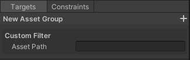<br>
  <font color="grey">Custom Filter</font>
</p>

### 独自のアセットコンストレイントを作成する
独自のアセットコンストレイントを作成するには、Editor フォルダ内に`AssetConstraint`を継承したクラスを作成します。

```cs
using System;
using System.IO;
using AssetRegulationManager.Editor.Core.Model.AssetRegulations;
using UnityEditor;
using UnityEngine;
using UnityEngine.Assertions;
using Object = UnityEngine.Object;

[Serializable]
[AssetConstraint("Custom/Custom Constraint", "Custom Constraint")] // Required for GUI.
public sealed class CustomAssetConstraint : AssetConstraint<Object>
{
    [SerializeField] private string _assetName;

    private string _latestValue;

    public string AssetName
    {
        get => _assetName;
        set => _assetName = value;
    }

    // Get a description of this constraint.
    public override string GetDescription()
    {
        return $"Asset Name: {_assetName}";
    }

    // Returns the most recently used value for the test as a string.
    public override string GetLatestValueAsText()
    {
        return string.IsNullOrEmpty(_latestValue) ? "None" : _latestValue;
    }

    // Returns true if the asset is within constraints.
    protected override bool CheckInternal(Object asset)
    {
        Assert.IsNotNull(asset);

        var assetPath = AssetDatabase.GetAssetPath(asset);
        var assetName = Path.GetFileNameWithoutExtension(assetPath);
        _latestValue = assetName;

        return _assetName == assetName;
    }
}
```

また GUI を描画するために`GUIDrawer`を継承したクラスを作成します。

```cs
using AssetRegulationManager.Editor.Foundation.CustomDrawers;
using UnityEditor;

[CustomGUIDrawer(typeof(CustomAssetConstraint))]
public sealed class CustomAssetConstraintDrawer : GUIDrawer<CustomAssetConstraint>
{
    public override void Setup(object target)
    {
        base.Setup(target);

        // If you want to setup this drawer, write here.
    }

    protected override void GUILayout(CustomAssetConstraint target)
    {
        target.AssetName = EditorGUILayout.TextField("Asset Name", target.AssetName);
    }
}
```

以上で独自のアセットコンストレイントを作成できました。

<p align="center">
  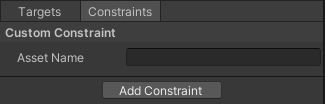<br>
  <font color="grey">Custom Constraint</font>
</p>

## ライセンス
本ソフトウェアはMITライセンスで公開しています。  
ライセンスの範囲内で自由に使っていただけますが、使用の際は以下の著作権表示とライセンス表示が必須となります。

* [LICENSE.md](LICENSE.md)

また、本ドキュメントの目次は以下のソフトウェアを使用して作成されています。

* [toc-generator](https://github.com/technote-space/toc-generator)

toc-generatorのライセンスの詳細は [Third Party Notices.md](Third%20Party%20Notices.md) を参照してください。
